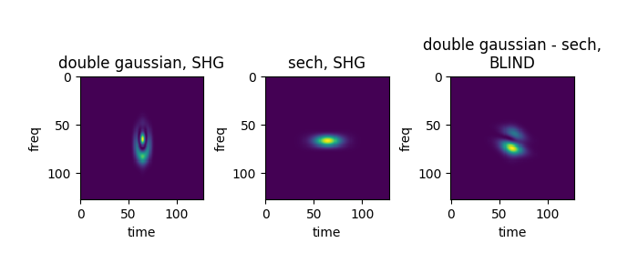

# froglib

A library to reconstruct the complex optical field of short optical pulses from FROG 
(Frequency Resolved Optical Gating[1]) traces.

For a comprehensive overview on the FROG technique, see: 
```
  Trebino, Rick. Frequency-resolved optical gating: the measurement of ultrashort laser pulses. 
  Springer Science & Business Media, 2012.
```
### What does froglib provide?

 - generate artificial FROG traces for Second Harmonic Generation (SHG) and Blind FROG setup
 - basic implementation of the PCGP (Principle Components Generalized
Projection) algorithm
 - basic reconstruction loops 
 - basic functions to remove simple ambiguities
 - tools to calculate the field with errorbars from a list of reconstructed fields
 
 ### What DOESN'T it provide?
  
 - A full-feature, ready-to-use end user program. In general, several unforeseeable things may happen
   when reconstructing a FROG trace. Even simple ambiguities are sometimes hard to detect automatically.
   Reconstruction sometimes tends to stick at traces with small Frog errors, which for the human inspector
    are clearly different from the experimental traces. In general, human interaction and judgement is unavoidable. 

 - Automatic calibration. Time and frequency grid of a FROG trace have to be choosen according to the Fourier 
   relation. Possibly, measure traces have to be stretched accordingly before starting reconstruction.  
   All calculations in froglib are done in normalized units (pixel).
   

## Usage

### generate FROG traces: **frogtr**
    
```
    import numpy as np
    from matplotlib import pyplot as plt
    import matplotlib
    from froglib import *
    
    tvec = np.linspace(-8,8, 128)
    #double pulse
    t0=0.4
    deltat = 0.7
    signal1 = np.exp(-((tvec+deltat/2)/t0)**2) - np.exp(-((tvec-deltat/2)/t0)**2) * np.exp((-(tvec-deltat/2)/t0 * -1j))
    signal2 = 1./np.cosh(tvec) * np.exp(1.0j * (0.6 * tvec + 0.5 * tvec**2))
    
    # generate traces
    
    F1 = frogtr(signal1, signal1, mode='shg')
    F2 = frogtr(signal2, signal2, mode='shg')
    F3 = frogtr(signal1, signal2, mode='blind')
    
    # plot traces
    
    spp = matplotlib.figure.SubplotParams(wspace=0.5)
    plt.figure(figsize=(7,3), subplotpars=spp)
    ax1= plt.subplot(131);plt.title("double gaussian, SHG")
    plt.imshow(np.abs(F1)**2)
    ax2= plt.subplot(132);plt.title("sech, SHG")
    plt.imshow(np.abs(F2)**2)
    ax3=plt.subplot(133);plt.title("double gaussian - sech,\nBLIND")
    plt.imshow(np.abs(F3)**2)
    
    for ax in [ax1,ax2,ax3]:
        ax.set_xlabel("time")
        ax.set_ylabel("freq")
```
   
 


   

### simple, single reconstruction

```
import numpy as np
from matplotlib import pyplot as plt
from froglib import *

# generate signal
tmax = 7
N = 128
tvec = np.linspace(-tmax, tmax, N)
deltat = 0.5
freqoff = 1.2
#two gaussians of different height and width, different freqs
field = 0.5 * np.exp( - (tvec-deltat)**2) - np.exp( - (tvec+deltat)**2/0.5**2) * np.exp(1.0j * freqoff * tvec)

# generate artifical trace (SHG)
Mexp = np.abs(frogtr(field, field, mode='shg'))

# use a simple loop of the PCGP algorithm
res = simplerec(Mexp, iterations=150)

# show result
simplerecresult(Mexp, res)
plt.show()
```
 
 